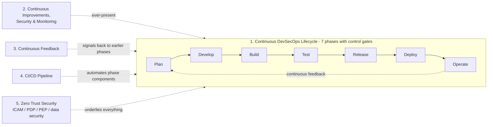

# Notional Reference Model for DevSecOps (NIST SSDF)

> NIST NCCoE's reference model bridging the architecture-agnostic SSDF (SP 800-218) to a concrete DevSecOps implementation: a seven-phase continuous lifecycle gated by control gates, wrapped by four cross-cutting dimensions including a Zero Trust underlay. Reproduction of Fig. 3.1.

## Provenance

| Field | Value |
| --- | --- |
| Source | [[2026-06-07-nist-devsecops-reference-model]] |
| Source's reference | Fig. 3.1 — "Notional Reference Model for DevSecOps for Demonstration of NIST SSDF" |
| Location | Section 3 (of a larger NCCoE project document) |
| Last confirmed | 2026-06-07 |

## The five functional dimensions

| # | Dimension | What it is |
| --- | --- | --- |
| 1 | **Phases of the Continuous DevSecOps Lifecycle** | Plan → Develop → Build → Test → Release → Deploy → Operate, with **control gates** between phases providing feedback before changes proceed. |
| 2 | **Continuous Improvements, Security & Monitoring** | Ever-present components giving phase-specific integrations. |
| 3 | **Continuous Feedback** | Signals from control gates / external events (new tech, attack patterns, regulations) fed back to earlier phases. |
| 4 | **CI/CD Pipeline** | Independent automated pipelines combined in sequence into the full build-and-deploy process. |
| 5 | **Zero Trust Security** | ZTA per NIST SP 1800-35 / SP 800-207 — ICAM, Policy Decision Point, Policy Enforcement Point, data security, security analytics, endpoint security, resource protection. |

## The seven phases

| Phase | Purpose (security-integrated) |
| --- | --- |
| **Plan** | Define functional/non-functional/security requirements; threat modeling; risk assessment; shift-left strategy. |
| **Develop** | Collaboratively create + proactively review code, IaC, and policy with approved tools. |
| **Build** | Automated pipelines → deployable artifacts in ephemeral environments with integrated analysis. |
| **Test** | Automated testing in ephemeral environments against functional/non-functional/security requirements. |
| **Release** | Package/transfer to production; coordinate releases; verify readiness & security; document changes. |
| **Deploy** | Install/configure on production infrastructure; verify security & performance. |
| **Operate** | Automated monitoring + evidence collection for integrity, security, reliability; feedback for improvement. |

Example Plan-phase components (per the source): certificate/configuration/credential/secrets management, threat-modeling system, risk-management system, requirements/product/project management, ticketing, Zero Trust security system, and cyber-intel feeds (OpenSSF, NVD, OSV, CVE/CWE).

## How to use this artifact

- **As a DevSecOps blueprint** aligned to the NIST SSDF — the phase + control-gate + Zero-Trust structure to map an organisation's pipeline against.
- **As the standards-grade counterpart** to vendor DevSecOps definitions ([[2023-03-10-redhat-what-is-devsecops|Red Hat]], [[2026-06-07-gitlab-what-is-devsecops|GitLab]]).

## Cross-references

- Parent source: [[2026-06-07-nist-devsecops-reference-model]]
- Concepts: [[devsecops]], [[devops]]
- Chase: NIST SP 800-218 (SSDF), SP 800-207 (Zero Trust), SP 1800-35 (ZTA implementation).
