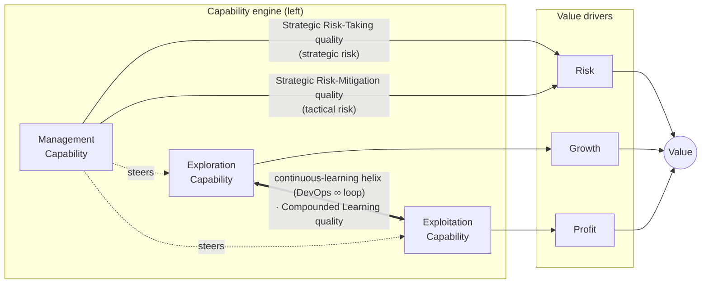

# CMR framework (Capability–Market–Risk)

**CMR** is a personal **business-architecture synthesis** that marries several otherwise-overlapping strategy models into one non-redundant model. In its originating blueprint (`background-docs/cmr-framework-blueprint.html`, local scratch) **CMR = Capability–Market–Risk**: an AI-native consolidation of [[mckinsey-7s-framework|McKinsey 7S]], VRIO, [[porter-five-forces|Porter's Five Forces]] and DESTEP into a small set of **non-overlapping dimensions across three pillars** (Capability, Market, Risk), so that no concept is re-derived — or contradicted — in two places.

This page documents the **final design** (`background-docs/cmr-framework.excalidraw`, local scratch): a value-driver model in which an explore/exploit **capability engine**, turning on a continuous **compounded-learning helix**, produces the firm's **Value**. The synthesis is user-originated; the wiki's role is to ground each component in the source frameworks it integrates.

**Scope of the model as drawn.** What the diagram shows is the **internal architecture of the organisation** — its capabilities, value drivers, and the learning loop that connects them. Of the blueprint's three CMR pillars, **Capability** and **Risk** are realised inside this interior; the **Market** pillar is an **external force** that has not yet been placed (see [§ Debates](#debates-and-supersession)). The model is therefore best read as *the inside of the firm boundary*, with Market as the environment that boundary faces.

## The model at a glance

The helix coil physically wraps the two capability diamonds in the diagram; the double-arrow above stands in for it. **Both risk qualities attach to Management → Risk** — Management Capability manages *strategic* risk (taking) and *tactical* risk (mitigation) together; neither is an Exploration/Growth-edge property. *Compounded Learning quality* sits on the helix crossover.

## Value core — Profit / Risk / Growth → Value

The right-hand cluster is a **value-driver tree**: the firm's **Value** is composed of three drivers — **Profit**, **Risk** and **Growth** — each feeding the central node, and **each the outcome of exactly one capability** (Exploitation → Profit, Management → Risk, Exploration → Growth). Treating **Risk as a value driver in its own right** rather than only a cost is the [[strategic-risk-management]] move: Management's two risk modes do not *become* Growth or Profit — they **enable** them. Strategic risk-taking, done well, is what lets Exploration pursue Growth; tactical risk-mitigation, done well, is what protects Exploitation's regular Profit stream. The valuation logic behind "drivers → Value" is the [[real-options|option]] and discounted-value reasoning catalogued from Damodaran ([[2008-01-01-damodaran-2008-strategic-risk-taking-ch11-strategic-risk-management]]); the intangible-to-value linkage echoes Kaplan & Norton's strategy maps ([[2004-04-01-kaplan-norton-2004-strategy-maps-soundview-summary]]).

## Capability engine — explore / exploit + Management

The left cluster is the **engine that produces the drivers**. It is the [[organizational-ambidexterity]] pair plus a governor. **Each capability produces exactly one value-driver outcome:**

| Node | Role | Outcome (its value driver) |
| --- | --- | --- |
| **Exploration Capability** | search for new value propositions under high uncertainty | **Growth** — new value, new streams |
| **Exploitation Capability** | run and optimise the existing business under low uncertainty | **Profit** — *sustaining a regular, recurring profit stream* from the established business |
| **Management Capability** | govern the portfolio; allocate, balance, decide; manage **both strategic risk (taking) and tactical risk (mitigation)** | **Risk** — the risk component of value (and *steers* both capability diamonds) |

The clean reading: **Exploration grows new value, Exploitation sustains existing profit, Management governs risk.** Three capabilities, three non-overlapping value drivers, one Value.

Management as a distinct, governing capability (drawn as a rectangle, not a diamond) is the part of the model that decides how much to bet on explore vs exploit — the C-suite balancing act that [[warner-wager-process-model]] places under `digital-seizing/balancing-digital-portfolios` and that [[organizational-ambidexterity]] frames as "running the whole continuum at once."

## The continuous-learning helix — a 7-phase loop

The helix wrapping the two diamonds is the **compounded-learning loop**: a translation of the [[devops|DevOps infinity loop]] into capability phases, threading the [[dynamic-capabilities]] **sensing → seizing → transforming** triad through the explore/exploit pair. The phases below sit on the coil; **Transfer** sits on the crossover — exactly the position the Strategyzer Business Model Portfolio Map gives it ("4 Explore stages → **Transfer** → 6 Exploit stages", [[2019-05-19-business-model-evolution-portfolio-map]]).

| Phase | Loop | Dynamic-capability cell ([[warner-wager-process-model]]) | DevOps origin ([[2026-06-07-what-is-devops-atlassian]]) |
| --- | --- | --- | --- |
| **Sense** | Exploration | `digital-sensing/digital-scouting` — *the radar: broad signal detection* | Discover / Observe |
| **Scout** | Exploration | `digital-sensing/scenario-planning` — *separating signal from noise* | Plan |
| **Seize** | Exploration | `digital-seizing/rapid-prototyping` | Build / Test |
| **Transfer** | **Crossover** | `digital-seizing/balancing-digital-portfolios` (explore→exploit handoff) | (Strategyzer *Transfer*) |
| **Deploy** | Exploitation | `digital-seizing/strategic-agility` | Deploy |
| **Transform** | Exploitation | `digital-transforming/improving-digital-maturity` | Operate |
| **Monitor** | Exploitation | `digital-sensing` (operational) | Observe / Continuous feedback |

Read as a cycle: **Sense → Scout → Seize** (explore: *Sense* is the radar that detects raw signals, *Scout* separates signal from noise, *Seize* acts on what survives) → **Transfer** (hand the validated learning across) → **Deploy → Transform → Monitor** (exploit: scale, embed, then watch) → feedback back to Sense. The exploration lobe is sensing-heavy; the exploitation lobe runs seize→transform→sense; the crossover is where compounded learning passes from one capability to the other. **Monitor sits last by design** — operational sensing is what closes the loop: the signals it produces re-seed **Sense** (the radar), making the feedback edge an explicit re-sensing step rather than a vague "back to start."

> **Provenance note on ordering.** The phase *names* (Sense/Scout/Seize/Transfer/Deploy/Transform/Monitor) and the cycle *order* are the user's own distillation, not verbatim DevOps or W&W vocabulary. Two deliberate sequencing choices (both 2026-06-07): the exploration lobe is **Sense → Scout** (Sense is the radar; Scout separates signal from noise — so the names intentionally invert the W&W *scouting* label, which here maps to *Sense*), and the exploitation lobe is **Deploy → Transform → Monitor** (Monitor last, closing the loop). The W&W cell and DevOps-origin columns are the *inferred mapping* onto that user-defined loop.

## Quality modulators

Three "quality" annotations modulate the model — they are the *how well*:

- **Compounded Learning quality** — on the **helix crossover**, governing how well learning compounds between exploration and exploitation. The faster and cleaner the [[devops|loop]], the more it compounds.
- **Strategic Risk-Taking quality** — *strategic* risk, owned by **Management Capability**: how well the firm takes option-like upside bets ([[real-options]], [[two-way-door-decisions]]).
- **Strategic Risk-Mitigation quality** — *tactical* risk, owned by **Management Capability**: how well downside is contained ([[strategic-risk-management]]).

**Both risk qualities are dimensions of Management Capability's governance of the Risk driver** — Management manages *strategic* risk (taking) and *tactical* risk (mitigation) as one job, not two separate owners. They modulate the Management → Risk edge; neither belongs to Exploration's Growth path. (An earlier draft mis-attributed risk-taking to the Exploration→Growth edge — corrected 2026-06-07.)

## How it marries the source models

| CMR element | Integrates |
| --- | --- |
| Capability / Market / Risk pillars | [[mckinsey-7s-framework]], VRIO, [[porter-five-forces]], DESTEP (per the blueprint) |
| Explore / Exploit capability diamonds | [[organizational-ambidexterity]] |
| Sensing / Seizing / Transforming phases | [[dynamic-capabilities]], [[warner-wager-process-model]] |
| The continuous-learning helix | [[devops]] infinity loop |
| The Transfer crossover | Strategyzer explore→Transfer→exploit lifecycle ([[2019-05-19-business-model-evolution-portfolio-map]]) |
| Risk as a value driver | [[strategic-risk-management]], [[real-options]] |
| Drivers → Value | [[2004-04-01-kaplan-norton-2004-strategy-maps-soundview-summary]], Damodaran valuation |

## Relation to the rest of the wiki

- **It is an applied instance of [[dynamic-capabilities]].** Where [[warner-wager-process-model]] gives the closed vocabulary of microfoundations, CMR arranges them on a *runnable loop* tied to explore/exploit capabilities — the same move [[devops]] makes at delivery cadence.
- **It operationalises [[organizational-ambidexterity]].** The two diamonds *are* the explore/exploit pair; the helix is the mechanism that keeps both running at once without one starving the other.
- **It treats [[strategic-risk-management]] as generative.** Risk sits among the value drivers, split into a taking-quality (upside, Growth) and a mitigation-quality (downside, Profit), mirroring Damodaran's "risk is opportunity" thesis.

## Sources

The framework is user-originated (diagram + blueprint in `background-docs/`, local scratch). It is grounded in:

- [[2019-12-19-warner-wager-2019-dynamic-capabilities-digital-transformation]] — the sensing/seizing/transforming triad.
- [[2020-03-16-explore-exploit-continuum]] and [[2019-05-19-business-model-evolution-portfolio-map]] — the explore/exploit continuum and the Transfer handoff.
- [[2026-06-07-what-is-devops-atlassian]] — the DevOps infinity loop the helix translates.
- [[2008-01-01-damodaran-2008-strategic-risk-taking-ch11-strategic-risk-management]] — risk as a two-sided value driver.
- [[2004-04-01-kaplan-norton-2004-strategy-maps-soundview-summary]] — intangible drivers → value.
- [[2008-01-01-porter-five-competitive-forces]] and [[2020-07-07-mckinsey-7s-model]] — the legacy frameworks CMR consolidates.

## Debates and supersession

- **The integration is novel, not sourced.** No single wiki source asserts the CMR synthesis as drawn — it is an interpretive bridge across frameworks. The components are each defensible; the *arrangement* is the user's. Confidence is held at 0.72 for that reason, despite the breadth of supporting sources.
- **The Market pillar is not yet integrated (open design decision).** The blueprint names three pillars — **Capability / Market / Risk** — but the current diagram only realises **Capability** (the explore/exploit engine) and **Risk** (the driver + quality modulators). **Market is absent by intent, not omission** — its placement is still being decided. The leading interpretation: **what the diagram shows so far is the *internal architecture* of the organisation, and Market is an *external force* that sits outside the firm boundary** — not a node inside the engine. Four sub-options are on the table:
  1. Market as a **fourth value driver** alongside Profit / Risk / Growth.
  2. Market as an **input into the sensing phases** (Scout / Sense / Monitor).
  3. Market as a **cross-cutting lens** over the whole loop.
  4. **Market as an external force / environment** outside the internal architecture — the boundary the firm sense across (the current leading view).

  Options 2 and 4 are complementary, not rival: if Market is the external field, then the **sensing phases are exactly the boundary-spanning organ** through which the internal architecture reaches into it. This is the classic internal/external strategy split the corpus already carries — [[porter-five-forces]] is the **external/industry** layer, [[mckinsey-7s-framework]] the **internal-alignment** layer, and [[warner-wager-process-model]] parks external shocks in `contextual/external-triggers`. Until decided, the diagram's value drivers (Profit / Risk / Growth) should **not** be read as the Market pillar's expression.
- **Phase ordering is inferred.** If the intended cycle differs from Scout→Sense→Seize→Transfer→Deploy→Monitor→Transform, the helix table needs revising.
- **Open question.** Is ambidexterity here **structural** (separate explore/exploit diamonds) or **contextual** (the same units switching modes via the helix)? The diagram leans structural; the helix hints contextual. Same unresolved tension flagged on [[organizational-ambidexterity]].
