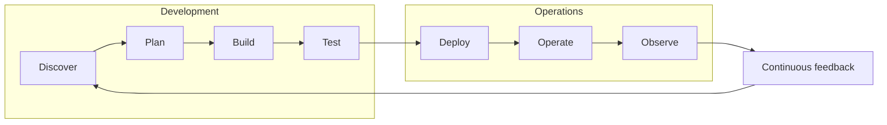

# DevOps

**DevOps** is a set of **practices, tools, and a cultural philosophy** that automate and integrate the processes between software development (Dev) and IT operations (Ops). Born ~2007 to dissolve the dev/ops silo, it aims to increase the **speed and quality** of software delivery through team empowerment, cross-team collaboration, and automation. Its defining insight (per the wiki's anchor sources) is that DevOps is **people + tools + culture** — and that **structure must precede tools** ("DevOps isn't any single person's job; it's everyone's job").

## The DevOps lifecycle (infinity loop)

Eight phases drawn as an **infinity (∞) loop**, not a line — symbolising constant collaboration and iterative improvement (Discover, Plan, Build, Test on the dev lobe; Deploy, Operate, Observe on the ops lobe; Continuous feedback closing it).

## Core practices

- **Continuous integration (CI)** — automated integration of code changes into a shared repo with automated tests.
- **Continuous delivery (CD)** — automated deployment to test/production via a release pipeline; **continuous deployment** (auto-to-production behind feature flags) is the further step.
- **Automation** — the most important practice; push-to-build/test/deploy.
- **Infrastructure as Code (IaC)** — infrastructure definitions as version-controlled code.
- **Microservices** — independently deployable services enabling CI/CD.
- **Monitoring / observability** — across the whole lifecycle; "shift left" to catch issues early.
- **Trunk-based development** — frequent commits to trunk + comprehensive automated testing (vs long-lived branches).

## Culture, frameworks, and structure

DevOps is as much culture as practice — see [[devops-culture-atlassian|DevOps culture]] (shared responsibility, "you build it, you run it", autonomous teams, blameless retrospectives, **MTTR over MTBF**). It is assessed via the **[[calms-framework]]** (Culture, Automation, Lean, Measurement, Sharing), measured via **[[dora-metrics]]**, and structured via **[[team-topologies]]** (stream-aligned / platform / complicated-subsystem / enabling teams). Security integrated into the lifecycle is **[[devsecops]]**.

## Benefits and the adoption trap

Evidence (DORA 2019, via Atlassian): elite teams deploy **208× more frequently** and **106× faster** than low performers. The recurrent failure mode is **"cargo-cult DevOps"** — adopting tools without the cultural/structural change. The fix: structure first, then process, then tools.

## Relation to the rest of the wiki

- **Digital transformation.** DevOps is a concrete instance of [[dynamic-capabilities]] microfoundations — `digital-seizing/rapid-prototyping` (CI/CD), `digital-transforming/redesigning-internal-structures` (team topologies), `digital-transforming/improving-digital-maturity` ([[warner-wager-process-model]]).
- **Organisational design & culture.** "Structure before tools" links to [[mckinsey-7s-framework]] (Structure/Systems) and [[organizational-culture]] (DevOps culture as a renewal-of-culture instance).

## Sources

- [[2026-06-07-what-is-devops-atlassian]] — the overview anchor (lifecycle, practices, benefits, DORA).
- [[2026-06-07-devops-culture-atlassian]] — the culture treatment.
- [[2026-06-07-calms-framework-atlassian]] — the CALMS assessment lens.
- [[2026-06-07-team-topologies-atlassian]] — the team-design lens.

## Debates and supersession

- All four current sources are **Atlassian vendor material** — mutually consistent but not independent; the underlying empirical authority is **DORA / *Accelerate*** (Forsgren, Humble, Kim), not yet ingested as a primary source. Confidence 0.8 pending an independent/empirical DevOps source.
- Open: where DevOps ends and **platform engineering** begins (flagged by the [[2023-03-10-redhat-what-is-devsecops|Red Hat]] and [[2026-06-07-gitlab-what-is-devsecops|GitLab]] DevSecOps sources) — a candidate future concept.
