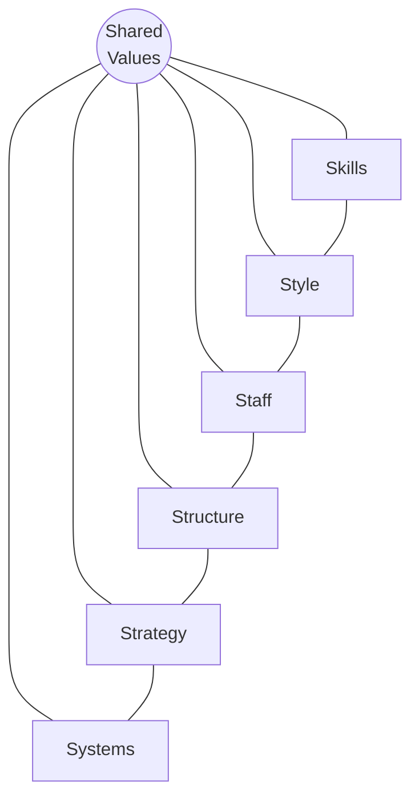

# McKinsey 7S Framework

The **McKinsey 7S Framework** analyses a company's **organisational design** through seven interdependent elements, originally developed at McKinsey (Tom Peters, Robert Waterman, Richard Pascale, Anthony Athos, ~1980). Its load-bearing claim is **interconnectedness**: the seven elements form a web, so changing one triggers a domino effect through the others — effective change requires re-aligning all seven, not adjusting one in isolation.

The wiki's working description follows the [[2020-07-07-mckinsey-7s-model|CFI explainer (Vipond 2020)]].

## The seven elements

| | Element | Meaning |
| --- | --- | --- |
| **Hard Ss** | **Structure** | Chain of command and accountability; the org chart |
| | **Strategy** | Plan for sustainable competitive advantage |
| | **Systems** | Business & technical infrastructure; workflows; decision chains |
| **Soft Ss** | **Shared Values** (centre) | Mission, objectives, values; the aligning foundation |
| | **Skills** | Capabilities and competencies |
| | **Style** | Management/leadership style; code of conduct |
| | **Staff** | Talent management: recruiting, training, rewards |

**Hard Ss** (Structure, Strategy, Systems) are tangible and management-directed; **Soft Ss** (Shared Values, Skills, Style, Staff) are intangible and culture-driven. Shared Values sits at the centre because founder/organisational values, when they shift, ripple through everything else.

## Application (top-down, four steps)

1. Identify areas not effectively aligned (gaps among values, strategy, structure, systems).
2. Determine the optimal organisational design (no off-the-shelf template).
3. Decide where and what changes to make (hierarchy, communication, reporting).
4. Make the changes (implementation is make-or-break; needs a plan).

Canonical use case: a **merger** simultaneously disrupts Structure, Staff, and Strategy — 7S surfaces the inconsistent areas to re-align.

## Strengths and limits

- **Strengths:** drives coherent ("synced") action; tracks change impact across elements; long-standing, widely adopted.
- **Limits:** long-term in nature; **internally focused** — weak where external circumstances dominate; descriptive only (no metric, no causal weighting between elements).

## Relation to the rest of the wiki

- **Internal-alignment layer.** 7S is the internal counterpart to the external [[porter-five-forces]] view; its acknowledged blind spot (external factors) is exactly where Five Forces and the [[warner-wager-process-model]] contextual triggers complement it.
- **Strategy-execution alignment.** Shares its core logic with the Kaplan & Norton strategy-map approach ([[2004-04-01-kaplan-norton-2004-strategy-maps-soundview-summary]]): strategy fails without alignment of the soft/intangible elements (skills, culture, leadership) to the hard ones (structure, systems).
- **Risk-taking organisation.** The Systems/Structure/Staff/Style elements map onto Damodaran's structural conditions for a [[strategic-risk-management|successful risk-taking organisation]] (governance, personnel, structure-culture).
- **Digital re-structuring.** Read through [[dynamic-capabilities]], the 7S re-alignment problem is the generic form of the W&W `redesigning-internal-structures` microfoundation.
- **Shared Values = culture.** The centre element, Shared Values, *is* [[organizational-culture]] — the aligning core that the Culture 500 research measures empirically (the [[big-9-cultural-values|Big 9]] and [[cultural-archetypes|archetypes]]).

## Sources

- [[2020-07-07-mckinsey-7s-model]] — CFI explainer (Vipond 2020). Secondary source; confidence capped at 0.7. Primary texts (Waterman, Peters & Phillips 1980; Peters & Waterman 1982) not yet in the wiki.

## Debates and supersession

_Single-source page._ Will be re-confirmed / deepened if the primary 7S texts are acquired. The model's internal-only focus is its standard critique; pair with [[porter-five-forces]] for the external view.
