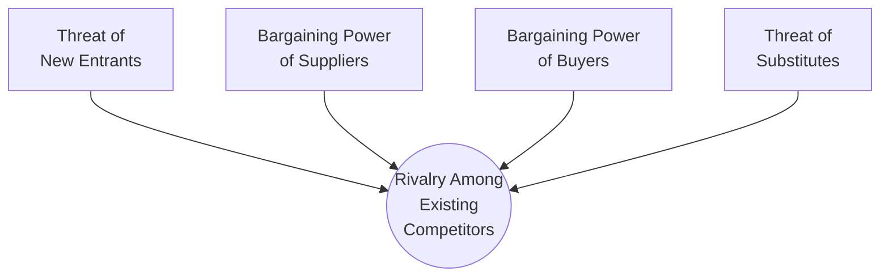

# Porter's Five Forces

**Porter's Five Forces** is a framework for analysing the **structural attractiveness (long-run profitability) of an industry** by assessing five sources of competitive pressure. Introduced by Michael E. Porter in his 1979 *Harvard Business Review* article and reaffirmed/extended in [[2008-01-01-porter-five-competitive-forces|his 2008 HBR update]], it reframes "competition" from rivalry-among-current-players to **extended rivalry** across five forces. The strongest force(s) govern profitability and should anchor strategy.

The core claim: **industry structure — not sector glamour (high-tech vs low-tech, emerging vs mature, regulated vs not) — drives profitability** in the medium-to-long run.

## The five forces

1. **Threat of new entrants** — capped by entry barriers and expected retaliation.
2. **Bargaining power of suppliers** — value captured by powerful input providers.
3. **Bargaining power of buyers** — value captured by powerful customers.
4. **Threat of substitutes** — a ceiling on prices from different-means alternatives.
5. **Rivalry among existing competitors** — the central force; most destructive when it gravitates to price.

## Seven sources of entry barriers

1. Supply-side economies of scale
2. Demand-side benefits of scale (network effects)
3. Customer switching costs
4. Capital requirements
5. Incumbency advantages independent of size (proprietary tech, locations, brand, experience)
6. Unequal access to distribution channels
7. Restrictive government policy

## When each force is strong

| Force | Strong when… |
| --- | --- |
| **New entrants** | Low entry barriers; weak expected retaliation; attractive returns |
| **Supplier power** | Suppliers concentrated; high switching costs; differentiated; credible forward-integration threat; no substitute |
| **Buyer power** | Few/large buyers; standardized products; low switching costs; credible backward-integration threat; buyer is price-sensitive |
| **Substitutes** | Attractive price-performance trade-off; low switching cost to substitute |
| **Rivalry** | Numerous/equal rivals; slow growth; high exit barriers; high fixed/low marginal cost; perishable product; identical offerings |

## What is NOT a sixth force

Porter is explicit that **industry growth rate, technology & innovation, government, and complementary products are not separate forces** — they shape profitability only *through* their effect on the five. A recurrent strategic error is mistaking these visible attributes for the underlying structure (e.g. assuming fast-growing or high-tech industries are automatically attractive — PCs were fast-growing yet among the least profitable industries).

## Three strategic moves

1. **Position** where the forces are weakest (Paccar's owner-operator focus → 68 profitable years, 10% price premium).
2. **Exploit shifts** in the forces (Apple's iTunes filling the music-distribution vacuum).
3. **Reshape** the balance in the firm's favour (standardise inputs to neutralise supplier power; expand services to counter buyer power; raise fixed costs of competing to deter entrants).

## Relation to the rest of the wiki

- **External vs internal vs risk layers.** Five Forces is the **external/industry layer**; [[mckinsey-7s-framework]] is the **internal-alignment layer**; [[strategic-risk-management]] is the **risk layer**. Together they bracket the strategy problem.
- **Structure vs capability.** Five Forces is the structure-side counterpart to the capability-side [[dynamic-capabilities]] / [[warner-wager-process-model]] view. Each is a partial critique of the other: structure-determinism vs capability-determinism.
- **Substitutes and disruption.** Porter's substitute/entrant analysis is the industry-side view of the disruption that the Strategyzer business-model sources ([[organizational-ambidexterity]], [[business-model-innovation]]) treat from the model-design side.

## Sources

- [[2008-01-01-porter-five-competitive-forces]] — Porter (2008), *HBR* reprint R0801E. The wiki's anchor reference. Confidence 0.9.
- [[porter-2008-industry-roic]] — the industry-ROIC artifact (the empirical exhibit showing the ~7× profitability spread driven by structure).

## Debates and supersession

_Single-source page._ The resource-based view and [[dynamic-capabilities]] literature offer a capability-side complement and partial critique (Porter underweights firm-specific heterogeneity and dynamics); ecosystem/platform theorists contest the "complements are not a sixth force" stance. Productive tension for a future synthesis, not a supersession.
