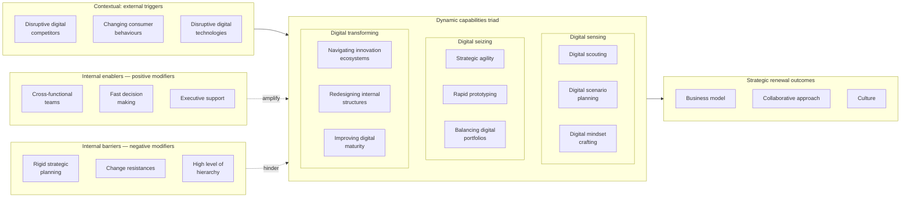

# Warner & Wäger (2019) process model

The **Warner & Wäger process model** is the wiki's canonical operationalisation of the dynamic-capabilities framework for digital-transformation contexts. It is the closed vocabulary that the wiki's `dynamic_capabilities:` frontmatter tag draws from, and the structural backbone of the [`neighbour-source-scan`](../../.claude/skills/neighbour-source-scan) skill's thematic adjacency index.

The model is grounded in a multiple-case qualitative study of seven German incumbent firms across automotive, industrial-equipment, banking, telecoms, energy, and media-publishing industries, triangulated with six strategy-consultancy partners. See [[2019-12-19-warner-wager-2019-dynamic-capabilities-digital-transformation]] for the full source page.

## The closed vocabulary — 15 cells across 5 buckets

| Bucket | Cell | Slug |
| --- | --- | --- |
| **Digital sensing** | Digital scouting | `digital-sensing/digital-scouting` |
| | Digital scenario planning | `digital-sensing/digital-scenario-planning` |
| | Digital mindset crafting | `digital-sensing/digital-mindset-crafting` |
| **Digital seizing** | Strategic agility | `digital-seizing/strategic-agility` |
| | Rapid prototyping | `digital-seizing/rapid-prototyping` |
| | Balancing digital portfolios | `digital-seizing/balancing-digital-portfolios` |
| **Digital transforming** | Navigating innovation ecosystems | `digital-transforming/navigating-innovation-ecosystems` |
| | Redesigning internal structures | `digital-transforming/redesigning-internal-structures` |
| | Improving digital maturity | `digital-transforming/improving-digital-maturity` |
| **Strategic renewal** | Renewal of business model | `strategic-renewal/business-model` |
| | Renewal of collaborative approach | `strategic-renewal/collaborative-approach` |
| | Renewal of culture | `strategic-renewal/culture` |
| **Contextual** | External triggers | `contextual/external-triggers` |
| | Internal enablers | `contextual/internal-enablers` |
| | Internal barriers | `contextual/internal-barriers` |

A source-page `dynamic_capabilities:` entry is the slug verbatim (e.g. `- digital-seizing/balancing-digital-portfolios`). Body prose may use either the full slug or the trailing element (`balancing-digital-portfolios`) — both satisfy the [body-twin rule](../../CLAUDE.md#body-twin-rule-load-bearing).

## The process model — visual reproduction



## What each bucket does

### Digital sensing

Capabilities for *making sense of the digital environment* — what is changing, where the threats and opportunities sit, and how to read disruptive signals before they fully materialise. The three microfoundations cover the analytical funnel:

- **Digital scouting** — informal and formal networks in the world's technology hubs to spot trends; competitor intelligence; customer-centric trend sensing through analytics and AI.
- **Digital scenario planning** — analysing scouted signals; interpreting digital future scenarios; formulating digital strategies that *replace* rigid 3–5-year strategic plans.
- **Digital mindset crafting** — establishing a long-term digital vision; promoting an entrepreneurial mindset; cultivating digital-first thinking throughout the organisation.

### Digital seizing

Capabilities for *acting on what was sensed* — fast enough to capture an opportunity before it closes, and disciplined enough to choose between several at once.

- **Strategic agility** — pacing strategic actions; rapidly reallocating resources; accepting redirection and change as a way of life. The paper names this as the *central* mechanism for the strategic renewal of an organisation.
- **Rapid prototyping** — minimum viable products; lean-start-up methodology; digital innovation labs that decentralise experimentation.
- **Balancing digital portfolios** — choosing between internal vs external options; scaling innovative business models; pacing execution speed across a portfolio of bets.

### Digital transforming

Capabilities for *making the change stick at organisational scale* — moving from successful experiments to durable structural and cultural change.

- **Navigating innovation ecosystems** — joining or building digital ecosystems; collaborating with external partners (co-creation, co-opetition); exploiting new ecosystem capabilities.
- **Redesigning internal structures** — appointing a chief digital officer; digitalising business-model architectures; designing team-based, decentralised structures.
- **Improving digital maturity** — assessing the workforce's digital readiness; recruiting digital talent externally; leveraging digital knowledge inside the firm.

### Strategic renewal

The three nested *outcomes* of digital transformation. The empirical claim is that they sequence — renewal tends to deepen in this order, with culture as the deepest, slowest, and most consequential layer.

- **Renewal of business model** — refreshing or replacing the value proposition. Transactional → relational / multisided value propositions; product logic → services logic.
- **Renewal of collaborative approach** — internal collaboration patterns (cross-functional teams, removed work silos) and external partnerships (open R&D, ecosystems of co-creators).
- **Renewal of culture** — the deepest layer. Digital mindsets, new hiring patterns, refreshed corporate values — the part that takes years and that authors emphasise should *not* erase historic values but rather refresh roots.

### Contextual contingencies

Three groups of three, framing what makes the dynamic-capability-building process succeed or stall.

- **External triggers**: disruptive digital competitors / changing consumer behaviours / disruptive digital technologies.
- **Internal enablers**: cross-functional teams / fast decision making / executive support.
- **Internal barriers**: rigid strategic planning / change resistances / high level of hierarchy.

## Role-defaults matrix (`role_defaults:`)

Each cell carries a default role profile — the business roles that would typically care about a source in that cell. Sources inherit role-relevance from their `dynamic_capabilities:` cells unless they explicitly override via `roles:`. Closed role vocabulary: nine C-suite (`ceo`, `coo`, `cfo`, `cso`, `cdo`, `cto`, `cio`, `chro`, `cmo`) and six functional (`product-manager`, `tech-lead`, `rd-director`, `innovation-lab-lead`, `transformation-lead`, `strategy-consultant`).

```yaml
role_defaults:
  digital-sensing/digital-scouting: [ceo, cso, cdo, cto, rd-director, strategy-consultant]
  digital-sensing/digital-scenario-planning: [ceo, cso, cdo, cfo, strategy-consultant, transformation-lead]
  digital-sensing/digital-mindset-crafting: [ceo, cdo, chro, transformation-lead, strategy-consultant]
  digital-seizing/strategic-agility: [ceo, coo, cdo, cso, transformation-lead, strategy-consultant]
  digital-seizing/rapid-prototyping: [cdo, cto, cio, product-manager, tech-lead, innovation-lab-lead, rd-director]
  digital-seizing/balancing-digital-portfolios: [ceo, cfo, cso, cdo, strategy-consultant]
  digital-transforming/navigating-innovation-ecosystems: [ceo, cso, cdo, cto, rd-director, innovation-lab-lead, strategy-consultant]
  digital-transforming/redesigning-internal-structures: [ceo, coo, cdo, chro, cio, transformation-lead]
  digital-transforming/improving-digital-maturity: [chro, cdo, ceo, transformation-lead, innovation-lab-lead]
  strategic-renewal/business-model: [ceo, cso, cdo, cfo, cmo, strategy-consultant]
  strategic-renewal/collaborative-approach: [ceo, coo, chro, cdo, transformation-lead]
  strategic-renewal/culture: [ceo, chro, cdo, transformation-lead]
  contextual/external-triggers: [ceo, cso, cdo, cmo, strategy-consultant]
  contextual/internal-enablers: [ceo, coo, chro, transformation-lead, strategy-consultant]
  contextual/internal-barriers: [ceo, coo, chro, transformation-lead, strategy-consultant]
```

These defaults are *inferred from the paper's discussion of who in the firm typically owns or champions each microfoundation* — they are working defaults, not a claim from the paper itself. Override on a per-source basis with the source page's `roles:` field when emphasis diverges.

## Tagging guidance — when to skip

Tagging is encouraged, not forced. Skip the `dynamic_capabilities:` field entirely when:

- The source is purely about LLM internals, model quantisation, attention mechanics, or other technology-internals work where the W&W lens does not apply.
- The only plausible cell is `contextual/external-triggers` and even that feels forced — leave the field off rather than over-fit.
- The source is purely methodological (an analysis tool, a vocabulary, a benchmark) without a digital-transformation use case attached.

A source that does not contribute to the digital-transformation reading of the corpus should not be forced into the vocabulary just to have a tag.

## Body-twin rule (load-bearing)

Every `dynamic_capabilities:` entry in a source-page's frontmatter must be reflected in the body — at minimum one sentence in the page summary saying *how* the source touches that cell, ideally naming which of the bullet-level activities listed above are in play. Lint matches on either the full slug or its trailing element.

## Tags as thematic adjacency index

Beyond classification, `dynamic_capabilities:` cells are the corpus's **thematic adjacency index**. Two source pages sharing a cell are conceptually adjacent — they are the first candidates for source-to-source typed `relationships:` per the [§Source-to-source relationships](../../CLAUDE.md#source-to-source-relationships) section of CLAUDE.md. The [`neighbour-source-scan`](../../.claude/skills/neighbour-source-scan) skill's Path A is exactly this query.

## Sources

- [[2019-12-19-warner-wager-2019-dynamic-capabilities-digital-transformation]] — the source page. The whole concept page is a structural reproduction of this paper's process model and operational vocabulary.

## Debates and supersession

_None yet — single-source page._ The closed vocabulary is the wiki's editorial choice, not a contested claim within the cited literature. Future sources that propose competing capability taxonomies (e.g. richer transforming-capability vocabularies for AI-native firms) will appear in this section.
